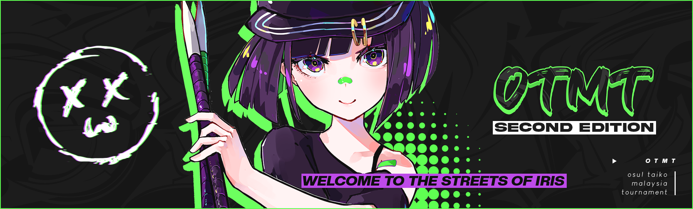

---
tags:
  - OTMT
  - OTMT2022
---

# osu!taiko Malaysian Tournament 2022

The **osu!taiko Malaysian Tournament 2022** (**OTMT 2022**) was a double-elimination 1v1 osu!taiko tournament hosted by ::{ flag=MY }:: [Jerry](https://osu.ppy.sh/users/605973). The tournament was restricted to players with the Malaysian flag ::{ flag=MY }:: only. It was the second installment of the osu!taiko Malaysian Tournament.

## Tournament schedule

| Event | Timestamp |
| --: | :-- |
| Registration phase | 2022-09-17 to 2022-10-01 |
| Qualifiers Showcase | 2022-10-08 |
| Qualifiers & Seedings Reveal | 2022-10-15 to 2022-10-16 |
| Group stage | 2022-10-22 to 2022-10-23 |
| Round of 16 | 2022-10-29 to 2022-10-30 |
| Quarterfinals | 2022-11-05 to 2022-11-06 |
| Semifinals | 2022-11-12 to 2022-11-13 |
| Finals | 2022-11-19 to 2022-11-20 |
| Grand Finals | 2022-11-27 |

## Prizes

| Placing | Prize |
| :-: | :-- |
|  | RM407 (~94USD), 4 month osu Supporter Tag, Custom Deskpad, Custom IRIS Voice Line, Profile Badge |
|  | RM207 (~48USD), 2 month osu Supporter Tag, Custom Deskpad, Custom IRIS Voice Line |
|  | RM107 (~25USD), 1 month osu Supporter Tag, Custom Deskpad, Custom IRIS Voice Line |
| *4th place* | RM56 (~25USD), 1 month osu Supporter Tag, Custom IRIS Voice Line |

 ## Organisation

The osu!taiko Malaysian Tournament 2022 was run by various community members.

| Position | Member(s) |
| :-- | :-- |
| Organizer | ::{ flag=MY }:: [Jerry](https://osu.ppy.sh/u/605973) |
| Mappool selector | ::{ flag=MY }:: [cdh](https://osu.ppy.sh/u/2403621), ::{ flag=MY }:: [\[Zeth\]](https://osu.ppy.sh/u/9912966), ::{ flag=MY }:: [Jerry](https://osu.ppy.sh/u/605973) |
| Referee | ::{ flag=PH }:: [Aiery](https://osu.ppy.sh/u/10363380), ::{ flag=MY }:: [IoEtoile](https://osu.ppy.sh/users/6709853), ::{ flag=MY }:: [Hand Sanitiser](https://osu.ppy.sh/u/5091293), ::{ flag=NL }:: [ikin5050](https://osu.ppy.sh/users/4007649), ::{ flag=ID }:: [XK2238](https://osu.ppy.sh/users/1139209), ::{ flag=MY }:: [\[Zeth\]](https://osu.ppy.sh/u/9912966), ::{ flag=SG }:: [\[arcpotato\]](https://osu.ppy.sh/u/12842392), ::{ flag=MY }:: [Jerry](https://osu.ppy.sh/u/605973), ::{ flag=MY }:: [cdh](https://osu.ppy.sh/u/2403621) |
| Streamer | ::{ flag=MY }:: [Jerry](https://osu.ppy.sh/u/605973), ::{ flag=MY }:: [Iyouka](https://osu.ppy.sh/u/7138499), ::{ flag=SG }:: [Spartric](https://osu.ppy.sh/users/7740442), ::{ flag=MY }:: [Cheeeeeeeeeew](https://osu.ppy.sh/u/7798789), ::{ flag=PH }:: [Aiery](https://osu.ppy.sh/u/10363380) |
| Commentator | ::{ flag=DE }:: [Joogs](https://osu.ppy.sh/users/8844167), ::{ flag=GB }:: [My Angel Subaru](https://osu.ppy.sh/u/17797595), ::{ flag=GB }:: [overdahedge2014](https://osu.ppy.sh/u/9864847), ::{ flag=PH }:: [Aiery](https://osu.ppy.sh/u/10363380), ::{ flag=ID }:: [XK2238](https://osu.ppy.sh/users/1139209), ::{ flag=MY }:: [Ping7731](https://osu.ppy.sh/u/7289284), ::{ flag=MY }:: [Jerry](https://osu.ppy.sh/u/605973), ::{ flag=MY }:: [HenNEET](https://osu.ppy.sh/u/14225265), ::{ flag=MY }:: [CrabCow](https://osu.ppy.sh/u/9755504), ::{ flag=SE }:: [Raphalge](https://osu.ppy.sh/u/3918650), ::{ flag=MY }:: [Xeltic Rival](https://osu.ppy.sh/u/7500364), ::{ flag=MY }:: [cdh](https://osu.ppy.sh/u/2403621), ::{ flag=MY }:: [\[Zeth\]](https://osu.ppy.sh/u/9912966), ::{ flag=MY }:: [Cryolien](https://osu.ppy.sh/u/1626983), ::{ flag=SG }:: [MTNTWarz](https://osu.ppy.sh/u/14036825) |
| Designer | ::{ flag=MY }:: [Iyouka](https://osu.ppy.sh/u/7138499) |
| Website Editor | ::{ flag=MY }:: [Kokoro Amamiya](https://osu.ppy.sh/users/9534110) |
| Wiki editor | ::{ flag=MY }:: [cdh](https://osu.ppy.sh/u/2403621) |

## Links

- [Official Website](https://otmt2022.osumalaysia.org/)
- [Discussion thread](https://osu.ppy.sh/community/forums/topics/1629138)
- [Livestream](https://www.twitch.tv/osutaikomalaysia)
- [Challonge bracket](https://challonge.com/eq90t8gq)
- [Schedule Spreadsheet](https://docs.google.com/spreadsheets/d/1ujdTXdpU2SyCneFrgARIsfUnOsfwL7rrS2nhTimSElo/edit#gid=1945276977)
 
## Participants

| Seed | Members |
| :-- | :-- |
| Top | ::{ flag=MY }:: [CrabCow](https://osu.ppy.sh/u/9755504), ::{ flag=MY }:: [JyaKeii](https://osu.ppy.sh/u/12086753), ::{ flag=MY }:: [vun](https://osu.ppy.sh/u/6932501), ::{ flag=MY }:: [HHVanilla Ice](https://osu.ppy.sh/u/12803930), ::{ flag=MY }:: [vernonlim](https://osu.ppy.sh/u/10167542), ::{ flag=MY }:: [HenNEET](https://osu.ppy.sh/u/14225265), ::{ flag=MY }:: [Fury Dragon](https://osu.ppy.sh/u/6332530), ::{ flag=MY }:: [K0rd31HP](https://osu.ppy.sh/u/15231510) |
| High | ::{ flag=MY }:: [Megumin-Sama](https://osu.ppy.sh/u/6201335), ::{ flag=MY }:: [Ping7731](https://osu.ppy.sh/u/7289284), ::{ flag=MY }:: [pisu](https://osu.ppy.sh/u/8339729), ::{ flag=MY }:: [PollyDoggo](https://osu.ppy.sh/u/11584592), ::{ flag=MY }:: [DXA FonG](https://osu.ppy.sh/u/15019527), ::{ flag=MY }:: [Admirable](https://osu.ppy.sh/u/9888395), ::{ flag=MY }:: [Kirowlet](https://osu.ppy.sh/u/7066483), ::{ flag=MY }:: [Kyrzer](https://osu.ppy.sh/u/5616675) |
| Low | ::{ flag=MY }:: [shaofoong](https://osu.ppy.sh/u/2398341), ::{ flag=MY }:: [zhev](https://osu.ppy.sh/u/6570008), ::{ flag=MY }:: [NickkyOnce](https://osu.ppy.sh/u/10508577), ::{ flag=MY }:: [5oulpoint](https://osu.ppy.sh/u/10194919), ::{ flag=MY }:: [Minisora](https://osu.ppy.sh/u/9627666), ::{ flag=MY }:: [Haryume](https://osu.ppy.sh/u/9351030), ::{ flag=MY }:: [King Hong](https://osu.ppy.sh/u/7263047), ::{ flag=MY }:: [Ayashiki](https://osu.ppy.sh/u/6859713) |
| Unseeded | ::{ flag=MY }:: [arebang9462](https://osu.ppy.sh/u/1810773), ::{ flag=MY }:: [Axorite](https://osu.ppy.sh/u/9124278), ::{ flag=MY }:: [Agagak](https://osu.ppy.sh/u/3645490) |
  
## Groups

| Group | Top seed | High seed | Low seed | Unseeded |
| :-: | :-- | :-- | :-- | :-- |
| **A** | ::{ flag=MY }:: [HHVanilla Ice](https://osu.ppy.sh/u/12803930) | ::{ flag=MY }:: [Admirable](https://osu.ppy.sh/u/9888395) | ::{ flag=MY }:: [zhev](https://osu.ppy.sh/u/6570008) | N/A | 
| **B** | ::{ flag=MY }:: [vernonlim](https://osu.ppy.sh/u/10167542) | ::{ flag=MY }:: [DXA FonG](https://osu.ppy.sh/u/15019527) | ::{ flag=MY }:: [Ayashiki](https://osu.ppy.sh/u/6859713) | N/A |
| **C** | ::{ flag=MY }:: [JyaKeii](https://osu.ppy.sh/u/12086753) | ::{ flag=MY }:: [Ping7731](https://osu.ppy.sh/u/7289284) | ::{ flag=MY }:: [King Hong](https://osu.ppy.sh/u/7263047) | N/A |
| **D** | ::{ flag=MY }:: [K0rd31HP](https://osu.ppy.sh/u/15231510) | ::{ flag=MY }:: [Kirowlet](https://osu.ppy.sh/u/7066483) | ::{ flag=MY }:: [Minisora](https://osu.ppy.sh/u/9627666) | ::{ flag=MY }:: [Axorite](https://osu.ppy.sh/u/9124278) |
| **E** | ::{ flag=MY }:: [vun](https://osu.ppy.sh/u/6932501) | ::{ flag=MY }:: [Megumin-Sama](https://osu.ppy.sh/u/6201335) | ::{ flag=MY }:: [shaofoong](https://osu.ppy.sh/u/2398341) | N/A |
| **F** | ::{ flag=MY }:: [Fury Dragon](https://osu.ppy.sh/u/6332530) | ::{ flag=MY }:: [Kyrzer](https://osu.ppy.sh/u/5616675) | ::{ flag=MY }:: [5oulpoint](https://osu.ppy.sh/u/10194919) | ::{ flag=MY }:: [arebang9462](https://osu.ppy.sh/u/1810773) |
| **G** | ::{ flag=MY }:: [HenNEET](https://osu.ppy.sh/u/14225265) | ::{ flag=MY }:: [PollyDoggo](https://osu.ppy.sh/u/11584592) | ::{ flag=MY }:: [NickkyOnce](https://osu.ppy.sh/u/10508577) | N/A |
| **H** | ::{ flag=MY }:: [CrabCow](https://osu.ppy.sh/u/9755504) | ::{ flag=MY }:: [pisu](https://osu.ppy.sh/u/8339729) | ::{ flag=MY }:: [Haryume](https://osu.ppy.sh/u/9351030) | ::{ flag=MY }:: [Agagak](https://osu.ppy.sh/u/3645490) |

## Podium

This competition has come to an end and resulted in the following podium:

| Placing | Player |
| :-: | :-- |
|  | ::{ flag=MY }:: [CrabCow](https://osu.ppy.sh/users/9755504) |
|  | ::{ flag=MY }:: [HHVanilla Ice](https://osu.ppy.sh/users/12803930) |
|  | ::{ flag=MY }:: [Jyakeii](https://osu.ppy.sh/users/12086753) |
| *4th place* | ::{ flag=MY }:: [vernonlim](https://osu.ppy.sh/users/10167542) |

## Mappools

### Grand Finals
  
- NoMod
  1. [Camellia - R U Still XXXX? (qish & My Angel Subaru) \[Collab of the xxxx\]](https://osu.ppy.sh/b/3891622)
  2. [Kolaa - async (ph0eniixz) \[ascended (otmt. ver)\]](https://osu.ppy.sh/b/3891658)
  3. [xavy - ko (taiko\_maniac1811) \[nuko\]](https://osu.ppy.sh/b/3891702)
  4. [saaa + kei\_iwata + stuv + wakadori - New York Back Raise (cdh & \_gt) \[ALL IN\]](https://osu.ppy.sh/b/3891624)
  5. [Camellia feat. Nanahira - FULLFLAVOR ONDO (Megafan) \[FULLFLAVOR TAIKO\]](https://osu.ppy.sh/b/3892519)
  6. [Ann-Melts P - JINSEI (cdh) \[ULTIMATE (OTMT Edit.)\]](https://osu.ppy.sh/b/3891631)
- Hidden
  1. [OKIMOCHI EXPRESSION - DISCO BROTHERS (HiroK) \[Inner Oni\]](https://osu.ppy.sh/b/3892411)
  2. [yukikaze - SAYURINOYATU (arcpotato & Rinze) \[ARC & LER'S INTER SECTION\]](https://osu.ppy.sh/b/3891653)
- HardRock
  1. [Mizuno Kenji vs. Anayama Daisuke - m3 (MTNTWarz) \[Resentment\]](https://osu.ppy.sh/b/3891690)
  2. [kessoku band - Guitar, Loneliness and Blue Planet (Jerry, Raphalge & MTNTWarz) \[bocc\]](https://osu.ppy.sh/b/3891758)
- DoubleTime
  1. [MAISONdes feat. KAF, Tsumiki - Tokyo Shandy Rendez-vous (cdh) \[ONI\]](https://osu.ppy.sh/b/3891656)
  2. [Yorushika - Hole in the Heart (ler1211, arcpotato & Hivie) \[Inter Oni\]](https://osu.ppy.sh/beatmapsets/1889513#taiko/3891660)
- FreeMod
  1. [Sound piercer "Espitz" - Mirage Fragrance (\[Zeth\] & MTNTWarz) \[Reminiscence\]](https://osu.ppy.sh/b/3891692)
  2. [EmoCosine - Nekojarashi (ler1211) \[Nya! (OTMT Edit.)\]](https://osu.ppy.sh/b/3891674)
  3. [Loli in early 20s - Wa Yoderi (Megafan) \[Seishinbyou (OTMT Ver.)\]](https://osu.ppy.sh/b/3892525)
- Tiebreaker
  1. **(CUSTOM SONG)** **[takehirotei as "Infinite Limit" - I.R.I.S (Jerry, cdh, taiko_maniac1811, ler1211, MTNTWarz, \[Zeth\] & CallMeLyra) \[Streets of IRIS\]](https://osu.ppy.sh/b/3891701)** 

### Finals

- NoMod
  1. [ Hommarju feat. mamiko -  Katayoku no tori (vzk) \[Judgment (OTMT ver.)\]](https://osu.ppy.sh/b/3880490)
  2. **(CUSTOM SONG)** [HowToPlayLN - ph0eniix.z (ph0eniixz) \[phoenix\]](https://osu.ppy.sh/b/3881843)
  3. [Se-U-Ra - Pale and dazzling dreamscape (ekumea1123) \[Inner Oni\]](https://osu.ppy.sh/b/3823066)
  4. [Brandy - Cross Time !! (\_gt) \[Fever Time!!\]](https://osu.ppy.sh/b/3881848)
  5. [Laur feat. Mishamo - Let's! Miracle\*HARDCORE! (N a N a) \[Waifucore\]](https://osu.ppy.sh/b/3680132)
  6. [Apo11o program feat. Ritsuka - SolarOrbit -Connected with the Espabrother- (ikin5050) \[OTMT\]](https://osu.ppy.sh/b/3881865)
- Hidden
  1. [Yunomi - Indoor-kei nara Trackmaker (feat. nicamoq) (Eyenine) \[Every Day, Every Night\]](https://osu.ppy.sh/b/3881906)
  2. [Satoshi (CV: Rica Matsumoto) - XY\&Z (Greenshell) \[Battle Bond (OTMT Ver.)\]](https://osu.ppy.sh/b/3881927)
- HardRock
  1. [Vivid BAD SQUAD - Alter Ego (cdh) \[Inner Oni\]](https://osu.ppy.sh/b/3881864)
  2. [Laur vs Juggernaut. - Last Judgement (ikin5050) \[A Story of Liberation\]](https://osu.ppy.sh/b/3881222)
- DoubleTime
  1. [Vivid BAD SQUAD x Hatsune Miku x Kagamine Rin - PaIII.SENSATION (cdh) \[INFATUATION\]](https://osu.ppy.sh/b/3881874)
  2. [hololive IDOL PROJECT - Kirameki Rider\* (KTYN) \[Inner Oni\]](https://osu.ppy.sh/b/2351909)
- FreeMod
  1. [fripSide - Sister's noise (takehirotei "20001th noise" remix) (Rinze) \[Railgun\]](https://osu.ppy.sh/b/3881880)
  2. [momone - dont say you quit the art course (Rinze) \[resolution\]](https://osu.ppy.sh/b/3881885)
  3. [METRO MEW - Kasou Na Heartbeat (Jerry) \[Serenity\]](https://osu.ppy.sh/b/3392670)
- Tiebreaker
  1. **(CUSTOM SONG)** **[Sparxe - What Do You C? (gaston\_2199, Megafan & KyeX) \[A Sight To Behold\]](https://osu.ppy.sh/b/3881919)**

  
Placeholders

  
### Semifinals
  
- NoMod
  1. [Tsumiki - Anonymous Fanfare (KTYN) \[// 404 Not Found. //\]](https://osu.ppy.sh/b/3871454)
  2. [DJHASH1M0T0KANNA - BangB00gie (7\_7) \[YuniNana Boogie\]](https://osu.ppy.sh/beatmapsets/1079552#taiko/2258650)
  3. [Hatsune Miku - Talent Shredder (toara\_fict) \[Oni\]](https://osu.ppy.sh/beatmapsets/537044#taiko/1138147)
  4. [KOTONOHOUSE - Labyrinth (Nifty) \[Black Sail\]](https://osu.ppy.sh/beatmapsets/1386801#taiko/2864592)
  5. [dj TAKA meets DJ YOSHITAKA ft.guit.good-cool - Elemental Creation -GITADO ROCK ver.- (frukoyurdakul) \[Inner Oni\]](https://osu.ppy.sh/beatmapsets/690344#taiko/1461118)
- Hidden
  1. [BilliumMoto - four veiled stars (Nifty) \[Inner Oni\]](https://osu.ppy.sh/beatmapsets/972301#taiko/2084704)
  2. [lapix feat. Luschel - Cranberry City (Charlotte) \[Inner Oni\]](https://osu.ppy.sh/beatmapsets/1133066#taiko/2366551)
- HardRock
  1. [braven - Nyctophobia (HEKUSODASU) \[KUSOni\]](https://osu.ppy.sh/beatmapsets/1291170#taiko/2680127)
  2. [Mrs. GREEN APPLE - Samama Festival! (katagiri bootleg) (KTYN) \[KTYN's Festival! (BPM225)\]](https://osu.ppy.sh/beatmapsets/1220204#taiko/2538385)
- DoubleTime
  1. [MAX COVERI - RUNNING IN THE 90'S (Default Guy) \[Retro Oni\]](https://osu.ppy.sh/beatmapsets/1369915#taiko/2832591)
  2. [Ono Hideyuki - sola (Mapper 31) \[Ura Oni\]](https://osu.ppy.sh/beatmapsets/131347#taiko/330848)
  3. [Sakuzyo - Eater Merry (eiri-) \[Oni\]](https://osu.ppy.sh/beatmapsets/1097688#taiko/2293612)
- FreeMod
  1. [sky_delta - Kreuz (\_DUSK\_) \[Inner Oni\]](https://osu.ppy.sh/beatmapsets/844081#taiko/1765808)
  2. [Hyphen - ^/7(L|?\[_(L+#<>+&|^(o) (\[Zeth\]) \[Faceless\]](https://osu.ppy.sh/beatmapsets/732250#taiko/1545035)
  3. [Sakuzyo - Lie (komasy) \[False\]](https://osu.ppy.sh/beatmapsets/920188#taiko/1921771)
- Tiebreaker
  1. **[t+pazolite vs RoughSketch - GRK Spice (tpz Overheat Remix) (Backfire) \[Taikocalypse DX\]](https://osu.ppy.sh/beatmapsets/799203#taiko/1678044)**

### Quarterfinals

- NoMod
  1. [sky\_delta Feat.Kanata.N - Crystal Clear and Nothing (yassu-) \[Inner Oni (long ver)\]](https://osu.ppy.sh/beatmapsets/858136#taiko/1800886)
  2. [t+pazolite vs. P\*Light - IZANA (eiri-) \[Inner Oni\]](https://osu.ppy.sh/beatmapsets/1098381#taiko/2294846)
  3. [AZKi - Fake.Fake.Fake (WTHBRO) \[Heaxys' Oni\]](https://osu.ppy.sh/beatmapsets/1283761#taiko/2723322)
  4. [PSYQUI - Architect (Nifty) \[Brutalism\]](https://osu.ppy.sh/beatmapsets/874516#taiko/1827736)
- Hidden
  1. [Erio wo kamatte-chan - Os-Uchujin (RM J-core Remix) (7\_7) \[Inner Oni\]](https://osu.ppy.sh/beatmapsets/736797#taiko/1554891)
  2. [Sewerslvt - inlove (Horiiizon) \[incompatible\]](https://osu.ppy.sh/beatmapsets/1311932#taiko/2719092)
- HardRock
  1. [Miki Sayaka vs. Miki Sayaka (fw. Miki Sayaka) - squartatrice (Reol) \[TK'S Inner Oni\]](https://osu.ppy.sh/beatmapsets/167783#taiko/824509)
  2. [Zekk - Hatsukoi Memories (namaniku) \[Inner Oni\]](https://osu.ppy.sh/beatmapsets/690025#taiko/1460477)
- DoubleTime
  1. [Vitamin C - Vacation (D3kuu) \[Happy oni\]](https://osu.ppy.sh/beatmapsets/1025990#taiko/2145737)
  2. [Tezuka x Qayo - NiNi (\_DUSK\_) \[Oni\]](https://osu.ppy.sh/beatmapsets/1048248#taiko/2192546)
- FreeMod
  1. [Sakura Miko,Shirakami Fubuki,Natsuiro Matsuri,Housyou Marine - Gimme ginmi virtua ru saikou star!!!! (Maimaing) \[Groovin Groovin Party!\]](https://osu.ppy.sh/beatmapsets/1423035#taiko/2930560)
  2. [Notorious - GIFT (7\_7) \[oni\]](https://osu.ppy.sh/beatmapsets/1300448#taiko/2697591)
  3. [PolyphonicBranch - Nijigen Dream Fever (\_Rise) \[Inner Oni\]](https://osu.ppy.sh/beatmapsets/1410471#taiko/2907913)
- Tiebreaker
  1. **[rejection - Signal feat. Such (Cychloryn) \[Beyond\]](https://osu.ppy.sh/beatmapsets/1104277#taiko/2307668)**

### Round of 16

- NoMod
  1. [sabi\_c - Class B (Maeda) \[Diff A\]](https://osu.ppy.sh/beatmapsets/1295205#taiko/2687456)
  2. [Digital Math - The Musky Thrust (Jaltzu) \[Inner Oni\]](https://osu.ppy.sh/beatmapsets/1153833#taiko/2408145)
  3. [doth - Toy Boxxxx (Sayaka-) \[Oni\]](https://osu.ppy.sh/beatmapsets/380854#taiko/833267)
  4. [tofubeats - CANDYYYLAND feat. LIZ (Pa's Lam System Remix) (Myckoll) \[Myruki's Sweet\]](https://osu.ppy.sh/beatmapsets/724269#taiko/1529288)
- Hidden
  1. [Sou - tontiki rantiki tin nomi kikou (nekomusya1234) \[Oni\]](https://osu.ppy.sh/beatmapsets/1313318#taiko/2721748)
  2. [Tatsh feat. Ayane - STARLIGHT TWILIGHT -GC edit- (ll-oscar) \[Inner Oni\]](https://osu.ppy.sh/beatmapsets/502704#taiko/1069808)
- HardRock
  1. [Chicala Lpis - Blackest Luxury Car (tasuke912) \[Inner Oni\]](https://osu.ppy.sh/beatmapsets/1098791#taiko/2295648)
  2. [MIMI feat. Hatsune Miku - Ai no Sukima (Rock Cover) (Hivie) \[Inner Oni\]](https://osu.ppy.sh/beatmapsets/1096932#taiko/2292104)
- DoubleTime
  1. [TUYU - Territory Battle (Jerry) \[Oni\]](https://osu.ppy.sh/beatmapsets/1363181#taiko/2820285)
  2. [Lena Raine - Pigstep (Fallmorph) \[Oni\]](https://osu.ppy.sh/beatmapsets/1162493#taiko/2424957)
- FreeMod
  1. [REDALiCE - Masakari Blade (Kobayu) \[Oni\]](https://osu.ppy.sh/beatmapsets/1238727#taiko/2575509)
  2. [otetsu - Minamo no Sakura, Yume wa Sakayume (hikikochan) \[Dreamless\]](https://osu.ppy.sh/beatmapsets/442068#taiko/950736)
  3. [Frums - 24eeev0-$ (Gamelan4) \[rubies87's Oni\]](https://osu.ppy.sh/beatmapsets/1111340#taiko/2331733)
- Tiebreaker
  1. **[Camellia - Quaoar (Nepuri) \[Transneptunian\]](https://osu.ppy.sh/beatmapsets/931741#taiko/1945451)**

### Group stage

- NoMod
  1. [Rob Gasser - Taking Over (feat. Miyoki) (-OvO-) \[Oni\]](https://osu.ppy.sh/beatmapsets/1118937#taiko/2339203)
  2. [The Super Mario Players feat. Kate Davis - Jump Up, Super Star! (Short ver.) (maziari1105) \[Oni\]](https://osu.ppy.sh/beatmapsets/710971#taiko/1503031)
  3. [Iglooghost - Bug Thief (D3kuu) \[Oni\]](https://osu.ppy.sh/beatmapsets/1259868#taiko/2620661)
- Hidden
  1. [Sakuzyo - Future Coaster (yuzu\_\_rinrin) \[Oni\]](https://osu.ppy.sh/beatmapsets/665612#taiko/1411288)
  2. [Akira Complex - Ether Strike (Axer) \[Oni\]](https://osu.ppy.sh/beatmapsets/1026097#taiko/2148715)
- HardRock
  1. [Yu\_Asahina - Trickstarz (kitafuma) \[Oni\]](https://osu.ppy.sh/beatmapsets/1118075#taiko/2335499)
  2. [ARForest - Birds of Plague (eiri-) \[Oni\]](https://osu.ppy.sh/beatmapsets/1241060#taiko/2588192)
- DoubleTime
  1. [Helblinde - Unconquered (Capu) \[Oni\]](https://osu.ppy.sh/beatmapsets/1052250#taiko/2199046)
  2. [Goose house - Hikaru nara (radar) \[Solo!\]](https://osu.ppy.sh/beatmapsets/1207466#taiko/2514437)
- FreeMod
  1. [A? - Arrogation (Cut Ver.) (ZTH) \[Oni\]](https://osu.ppy.sh/beatmapsets/1291023#taiko/2681860)
  2. [t+pazolite - Our Wrenally (Uncut Edition) (komasy) \[Oni\]](https://osu.ppy.sh/beatmapsets/892110#taiko/1864987)
- Tiebreaker
  1. **[Venetian Snares - Epidermis (Horiiizon) \[HiroK's Oni\]](https://osu.ppy.sh/beatmapsets/1262133#taiko/2663673)**

## Match results

### Grand Finals

Saturday, 29 May 2021:

| Player 1 |  |  | Player 2 | Match link |
| --: | --: | :-: | :-: | :-- |
| apaajaboleh10 ::{ flag=ID }:: | 3 | **7** | ::{ flag=PH }:: **jmeh07** | [#1](https://osu.ppy.sh/community/matches/84478134) |
| **Katdon\_donKat** ::{ flag=ID }:: | **7** | 1 | ::{ flag=PH }:: jmeh07 | [#1](https://osu.ppy.sh/community/matches/84490291) |

### Finals

Saturday, 22 May 2021:

| Player 1 |  |  | Player 2 | Match link |
| --: | --: | :-: | :-: | :-- |
| Jerry ::{ flag=MY }:: | 3 | **7** | ::{ flag=ID }:: **Volta** | [#1](https://osu.ppy.sh/community/matches/83925010) |
| **Katdon\_donKat** ::{ flag=ID }:: | **7** | 4 | ::{ flag=ID }:: apaajaboleh10 | [#1](https://osu.ppy.sh/community/matches/83958413) |

Sunday, 23 May 2021:

| Player 1 |  |  | Player 2 | Match link |
| --: | --: | :-: | :-: | :-- |
| tzechi ::{ flag=SG }:: | -1 | **0** | ::{ flag=PH }:: **jmeh07** | *win by default* |
| Volta ::{ flag=ID }:: | 0 | **7** | ::{ flag=PH }:: **jmeh07** | [#1](https://osu.ppy.sh/community/matches/84027894) |

### Semifinals

Saturday, 15 May 2021:

| Player 1 |  |  | Player 2 | Match link |
| --: | :-: | :-: | :-- | :-- |
| **Volta** ::{ flag=ID }:: | **6** | 0 | ::{ flag=PH }:: CoEqual | [#1](https://osu.ppy.sh/community/matches/83378695) |
| misaki\_tk ::{ flag=ID }:: | 4 | **6** | ::{ flag=AU }:: **r1chyy** | [#1](https://osu.ppy.sh/community/matches/83383801) |
| Aiery ::{ flag=PH }:: | 3 | **6** | ::{ flag=ID }:: **Naverlyn** | [#1](https://osu.ppy.sh/community/matches/83386494) |
| **apaajaboleh10** ::{ flag=ID }:: | **6** | 5 | ::{ flag=SG }:: tzechi | [#1](https://osu.ppy.sh/community/matches/83389059) |
| Ponamis ::{ flag=TH }:: | 2 | **6** | ::{ flag=PH }:: **jmeh07** | [#1](https://osu.ppy.sh/community/matches/83391904) |
| Jerry ::{ flag=MY }:: | 0 | **6** | ::{ flag=ID }:: **Katdon\_donKat** | [#1](https://osu.ppy.sh/community/matches/83405952) |

Sunday, 16 May 2021:

| Player 1 |  |  | Player 2 | Match link |
| --: | :-: | :-: | :-- | :-- |
| **Volta** ::{ flag=ID }:: | **6** | 5 | ::{ flag=ID }:: Naverlyn | [#1](https://osu.ppy.sh/community/matches/83464591) |
| **jmeh07** ::{ flag=PH }:: | **6** | 2 | ::{ flag=AU }:: r1chyy | [#1](https://osu.ppy.sh/community/matches/83475288) |

### Quarterfinals

Saturday, 8 May 2021:

| Player 1 |  |  | Player 2 | Match link |
| --: | :-: | :-: | :-- | :-- |
| nikolpai\_15 ::{ flag=MY }:: | 0 | **6** | ::{ flag=PH }:: **CoEqual** | [#1](https://osu.ppy.sh/community/matches/82831488) |
| **apaajaboleh10** ::{ flag=ID }:: | **6** | 4 | ::{ flag=PH }:: Aiery | [#1](https://osu.ppy.sh/community/matches/82834608) |

Sunday, 9 May 2021:

| Player 1 |  |  | Player 2 | Match link |
| --: | :-: | :-: | :-- | :-- |
| **Katdon\_donKat** ::{ flag=ID }:: | **6** | 0 | ::{ flag=TH }:: Ponamis | [#1](https://osu.ppy.sh/community/matches/82853146) |
| Prehistoria ::{ flag=SG }:: | 1 | **6** | ::{ flag=PH }:: **jmeh07** | [#1](https://osu.ppy.sh/community/matches/82852417) |
| Volta ::{ flag=ID }:: | 2 | **6** | ::{ flag=SG }:: **tzechi** | [#1](https://osu.ppy.sh/community/matches/82915394) |
| **Naverlyn** ::{ flag=ID }:: | **6** | 0 | ::{ flag=PH }:: ezeenS | [#1](https://osu.ppy.sh/community/matches/82917432) |
| Element118 ::{ flag=SG }:: | 1 | **6** | ::{ flag=AU }:: **r1chyy** | [#1](https://osu.ppy.sh/community/matches/82919450) |
| **Jerry** ::{ flag=MY }:: | **6** | 2 | ::{ flag=ID }:: misaki\_tk | [#1](https://osu.ppy.sh/community/matches/82921604) |

### Round of 16

Saturday, 1 May 2021:

| Player 1 |  |  | Player 2 | Match link |
| --: | :-: | :-: | :-- | :-- |
| **Volta** ::{ flag=ID }:: | **5** | 1 | ::{ flag=SG }:: Element118 | [#1](https://osu.ppy.sh/community/matches/82234962) |
| **Jerry** ::{ flag=MY }:: | **5** | 0 | ::{ flag=MY }:: nikolpai\_15 | [#1](https://osu.ppy.sh/community/matches/82255830) |
| **Ponamis** ::{ flag=TH }:: | **5** | 0 | ::{ flag=PH }:: ezeenS | [#1](https://osu.ppy.sh/community/matches/82257768) |

Sunday, 2 May 2021:

| Player 1 |  |  | Player 2 | Match link |
| --: | :-: | :-: | :-- | :-- |
| **Katdon\_donKat** ::{ flag=ID }:: | **5** | 0 | ::{ flag=ID }:: Naverlyn | [#1](https://osu.ppy.sh/community/matches/82277963) |
| **misaki\_tk** ::{ flag=ID }:: | **5** | 0 | ::{ flag=PH }:: CoEqual | [#1](https://osu.ppy.sh/community/matches/82343068) |
| jmeh07 ::{ flag=PH }:: | 3 | **5** | ::{ flag=PH }:: **Aiery** | [#1](https://osu.ppy.sh/community/matches/82346921) |
| **tzechi** ::{ flag=SG }:: | **5** | 3 | ::{ flag=AU }:: r1chyy | [#1](https://osu.ppy.sh/community/matches/82351619) |
| **apaajaboleh10** ::{ flag=ID }:: | **5** | 1 | ::{ flag=SG }:: Prehistoria | [#1](https://osu.ppy.sh/community/matches/82353782) |

### Group stage

Saturday, 24 April 2021:

| Player 1 |  |  | Player 2 | Match link |
| --: | :-: | :-: | :-- | :-- |
| **apaajaboleh10** ::{ flag=ID }:: | **4** | 1 | ::{ flag=AU }:: Tsubasa2 | [#1](https://osu.ppy.sh/community/matches/81653293) |
| **Jerry** ::{ flag=MY }:: | **4** | 3 | ::{ flag=PH }:: Aiery | [#1](https://osu.ppy.sh/community/matches/81653228) |
| **CoEqual** ::{ flag=PH }:: | **0** | -1 | ::{ flag=PH }:: Astrid Park | *win by default* |
| **Volta** ::{ flag=ID }:: | **4** | 0 | ::{ flag=PH }:: ezeenS | [#1](https://osu.ppy.sh/community/matches/81661181) |
| DescriptiCringe ::{ flag=PH }:: | 0 | **4** | ::{ flag=NZ }:: **Bwhaa** | [#1](https://osu.ppy.sh/community/matches/81665715) |
| **Ponamis** ::{ flag=TH }:: | **4** | 1 | ::{ flag=SG }:: Element118 | [#1](https://osu.ppy.sh/community/matches/81656430) |
| AmateurMonkeyYT ::{ flag=AU }:: | 1 | **4** | ::{ flag=MY }:: **vun** | [#1](https://osu.ppy.sh/community/matches/81657502) |
| Naverlyn ::{ flag=ID }:: | 0 | **4** | ::{ flag=SG }:: **tzechi** | [#1](https://osu.ppy.sh/community/matches/81657634) |
| ConieSan ::{ flag=TH }:: | 1 | **4** | ::{ flag=PH }:: qish | [#1](https://osu.ppy.sh/community/matches/81657906) |
| Beat43210 ::{ flag=AU }:: | -1 | **0** | ::{ flag=NZ }:: **arley\_** | *win by default* |
| **Tsubasa2** ::{ flag=AU }:: | **0** | -1 | ::{ flag=PH }:: Astrid Park | *win by default* |
| Bedwyr Aorta ::{ flag=MY }:: | 3 | **4** | ::{ flag=MY }:: **nikolpai\_15** | [#1](https://osu.ppy.sh/community/matches/81659814) |
| **Aiery** ::{ flag=PH }:: | **4** | 0 | ::{ flag=MY }:: CrabCow | [#1](https://osu.ppy.sh/community/matches/81660028) |
| **Ponamis** ::{ flag=TH }:: | **4** | 0 | ::{ flag=SG }:: dantoh000 | [#1](https://osu.ppy.sh/community/matches/81660953) |
| **Naverlyn** ::{ flag=ID }:: | **4** | 0 | ::{ flag=MY }:: TaikOseania | [#1](https://osu.ppy.sh/community/matches/81661153) |
| **Jerry** ::{ flag=MY }:: | **4** | 0 | ::{ flag=TH }:: KappuChinooo | [#1](https://osu.ppy.sh/community/matches/81662208) |
| **Prehistoria** ::{ flag=SG }:: | **0** | -1 | ::{ flag=NZ }:: arley\_ | *win by default* |
| **Kotaro** ::{ flag=PH }:: | **4** | 0 | ::{ flag=NZ }:: Blujae | [#1](https://osu.ppy.sh/community/matches/81662982) |
| Tsubasa2 ::{ flag=AU }:: | 3 | **4** | ::{ flag=PH }:: **CoEqual** | [#1](https://osu.ppy.sh/community/matches/81663047) |
| **ezeenS** ::{ flag=PH }:: | **4** | 2 | ::{ flag=PH }:: DescriptiCringe | [#1](https://osu.ppy.sh/community/matches/81664069) |
| **Element118** ::{ flag=SG }:: | **4** | 0 | ::{ flag=AU }:: AmateurMonkeyYT | [#1](https://osu.ppy.sh/community/matches/81664398) |
| **tzechi** ::{ flag=SG }:: | **4** | 0 | ::{ flag=TH }:: ConieSan | [#1](https://osu.ppy.sh/community/matches/81665397) |
| **Prehistoria** ::{ flag=SG }:: | **0** | -1 | ::{ flag=AU }:: Beat43210 | *win by default* |
| **jmeh07** ::{ flag=PH }:: | 0 | -1 | ::{ flag=SG }:: Bobfree | *win by default* |
| **Element118** ::{ flag=SG }:: | **4** | 3 | ::{ flag=SG }:: dantoh000 | [#1](https://osu.ppy.sh/community/matches/81667577) |
| **tzechi** ::{ flag=SG }:: | **4** | 0 | ::{ flag=MY }:: TaikOseania | [#1](https://osu.ppy.sh/community/matches/81667594) |
| **Prehistoria** ::{ flag=SG }:: | **0** | -1 | ::{ flag=SG }:: \_gt | *win by default* |

Sunday, 25 April 2021:

| Player 1 |  |  | Player 2 | Match link |
| --: | :-: | :-: | :-- | :-- |
| **Katdon\_donKat** ::{ flag=ID }:: | **0** | -1 | ::{ flag=PH }:: Kotaro | *win by default* |
| **Naverlyn** ::{ flag=ID }:: | **4** | 0 | ::{ flag=TH }:: ConieSan | [#1](https://osu.ppy.sh/community/matches/81682418) |
| **Aiery** ::{ flag=PH }:: | **4** | 0 | ::{ flag=TH }:: KappuChinooo | [#1](https://osu.ppy.sh/community/matches/81682450) |
| r1chyy ::{ flag=AU }:: | 0 | **4** | ::{ flag=ID }:: **Katdon\_donKat** | [#1](https://osu.ppy.sh/community/matches/81681284) |
| **Katdon\_donKat** | **4** | 0 | ::{ flag=NZ }:: Blujae | [#1](https://osu.ppy.sh/community/matches/81732057) |
| **Jerry** ::{ flag=MY }:: | **4** | 1 | ::{ flag=MY }:: CrabCow | [#1](https://osu.ppy.sh/community/matches/81742310) |
| **apaajaboleh10** ::{ flag=ID }:: | **4** | 0 | ::{ flag=PH }:: CoEqual | [#1](https://osu.ppy.sh/community/matches/81741418) |
| **r1chyy** ::{ flag=AU }:: | **4** | 2 | ::{ flag=PH }:: Kotaro | [#1](https://osu.ppy.sh/community/matches/81743719) |
| **Volta** ::{ flag=ID }:: | **4** | 0 | ::{ flag=PH }:: DescriptiCringe | [#1](https://osu.ppy.sh/community/matches/81744585) |
| **Jerry** ::{ flag=MY }:: | **0** | -1 | ::{ flag=SG }:: kuudere-desu | *win by default* |
| **ezeenS** ::{ flag=PH }:: | **4** | 1 | ::{ flag=NZ }:: Bwhaa | [#1](https://osu.ppy.sh/community/matches/81744609) |
| Bobfree ::{ flag=SG }:: | -1 | **0** | ::{ flag=MY }:: Bedwyr Aorta | *win by default* |
| **misaki\_tk** ::{ flag=ID }:: | **4** | 1 | ::{ flag=SG }:: \_gt | [#1](https://osu.ppy.sh/community/matches/81745778) |
| **Element118** ::{ flag=SG }:: | **4** | 1 | ::{ flag=MY }:: vun | [#1](https://osu.ppy.sh/community/matches/81746378) |
| **tzechi** ::{ flag=SG }:: | **4** | 0 | ::{ flag=PH }:: qish | [#1](https://osu.ppy.sh/community/matches/81746400) |
| **misaki\_tk** ::{ flag=ID }:: | **0** | -1 | ::{ flag=AU }:: Beat43210 | *win by default* |
| **jmeh07** ::{ flag=PH }:: | **4** | 0 | ::{ flag=MY }:: Bedwyr Aorta | [#1](https://osu.ppy.sh/community/matches/81747164) |
| **Ponamis** ::{ flag=TH }:: | **4** | 1 | ::{ flag=AU }:: AmateurMonkeyYT | [#1](https://osu.ppy.sh/community/matches/81747688) |
| **CrabCow** ::{ flag=MY }:: | **4** | 2 | ::{ flag=SG }:: kuudere-desu | [#1](https://osu.ppy.sh/community/matches/81747808) |
| **misaki\_tk** ::{ flag=ID }:: | **4** | 0 | ::{ flag=NZ }:: arley\_ | [#1](https://osu.ppy.sh/community/matches/81749321) |
| **Naverlyn** ::{ flag=ID }:: | **4** | 2 | ::{ flag=PH }:: qish | [#1](https://osu.ppy.sh/community/matches/81749317) |
| AmateurMonkeyYT ::{ flag=AU }:: | 1 | **4** | ::{ flag=SG }:: **dantoh000** | [#1](https://osu.ppy.sh/community/matches/81749901) |
| **ConieSan** ::{ flag=TH }:: | **4** | 0 | ::{ flag=MY }:: TaikOseania | [#1](https://osu.ppy.sh/community/matches/81749363) |
| Beat43210 ::{ flag=AU }:: | -1 | **0** | ::{ flag=SG }:: **\_gt** | *win by default* |
| **Aiery** ::{ flag=PH }:: | **4** | 0 | ::{ flag=SG }:: kuudere-desu | [#1](https://osu.ppy.sh/community/matches/81749384) |
| **CrabCow** ::{ flag=MY }:: | **4** | 1 | ::{ flag=TH }:: KappuChinooo | [#1](https://osu.ppy.sh/community/matches/81750811) |
| **misaki\_tk** ::{ flag=ID }:: | **4** | 2 | ::{ flag=SG }:: Prehistoria | [#1](https://osu.ppy.sh/community/matches/81750774) |
| **nikolpai\_15** ::{ flag=MY }:: | 0 | -1 | ::{ flag=SG }:: Bobfree | *win by default* |
| **r1chyy** ::{ flag=AU }:: | **4** | 1 | ::{ flag=NZ }:: Blujae | [#1](https://osu.ppy.sh/community/matches/81752028) |
| **apaajaboleh10** ::{ flag=ID }:: | **0** | -1 | ::{ flag=PH }:: Astrid Park | *win by default* |
| **jmeh07** ::{ flag=PH }:: | **4** | 0 | ::{ flag=MY }:: nikolpai\_15 | [#1](https://osu.ppy.sh/community/matches/81753776) |
| **Ponamis** ::{ flag=TH }:: | **4** | 1 | ::{ flag=MY }:: vun | [#1](https://osu.ppy.sh/community/matches/81752573) |
| **arley\_** ::{ flag=NZ }:: | **4** | 3 | ::{ flag=SG }:: \_gt | [#1](https://osu.ppy.sh/community/matches/81753509) |
| **vun** ::{ flag=MY }:: | **4** | 1 | ::{ flag=SG }:: dantoh000 | [#1](https://osu.ppy.sh/community/matches/81755826) |
| **qish** ::{ flag=PH }:: | **4** | 0 | ::{ flag=MY }:: TaikOseania | [#1](https://osu.ppy.sh/community/matches/81756549) |
| **Volta** ::{ flag=ID }:: | **4** | 0 | ::{ flag=NZ }:: Bwhaa | [#1](https://osu.ppy.sh/community/matches/81759925) |
| kuudere-desu ::{ flag=SG }:: | -1 | **0** | ::{ flag=TH }:: **KappuChinooo** | *win by default* |
 

## Ruleset

### Registration rules

1. This tournament is open to ALL players with the Malaysian flag on their profile. However, it is highly recommended that you are able to at least play the Group Stage pool of the previous OTMT if you are participating this year.
2. You MUST join the [osu!taiko Malaysia Discord Server](https://discord.gg/8PTAJJaPKa) to be eligible for the tournament.
3. Registrations must be submitted through the [official OTMT website](https://otmt2022.osumalaysia.org/home) when the links are available on 17th September.
3. All registered players will undergo an initial screening process by the osu!staff and any players that do not pass the screening will not be eligible to participate in the tournament. Results of the screening will be announced in the Discord server.
4. The star rating of the mappool throughout the tournament is estimated to go from ~4.5* in the early rounds to ~7* in the later stages.

### General rules

1. The tournament is a 1v1 osu!taiko match; highest score wins.
2. ScoreV2 with the Head-to-Head option will be used .
3. The score format of each round is as listed below:

| Round	| Format | Points to Win |
| --- |   -----   | :---: |
| Group Stage	| Best-of-9	| 5 |
| Round of 16 |	Best-of-9	| 5 |
| Quarterfinals	| Best-of-11 | 6 |
| Semifinals | Best-of-11	| 6 |
| Finals | Best-of-13 | 7 |
| Grand Finals | Best-of-13 | 7 |

4. The tournament host will release the mappool and schedules one week before each round.
5. If required, players may request for a reschedule of their matches via the #otmt-reschedule channel in the Discord server.
   - Reschedules will only be allowed before the Thursdays, 23:59 UTC+8 of every week.

### Tournament structure

1. The tournament starts off with the Qualifiers stage to sort the players into their respective seedings in the Top 32 (Top Seed, High Seed, Low Seed, etc).
2. The top 32 players will then advance to the Group Stages to further narrow down the players into the Top 16.
3. In the Group Stages, players will be arranged into 8 separate groups of 4, with each group consisting of one player from each seed ranking (top, high, mid, low).
4. The four players will be matched against each other throughout the weekend and the two (2) players with the highest number of W:L (win-loss) ratio will advance to the RO16.
5. If the number of registrants are below 32, some groups will only consist of 3 players.
  
### Match rules
  
1. Players are required to be present at the times of their match, a reminder in the form of a Discord ping will be given to the players 15 minutes before every match.
2. Invites to the room will then be sent out 10 minutes before each match.
3. Failure to arrive on time will result in the following penalties:
   - 5-minutes: Player’s warmup will be skipped.
   - 10-minutes: Player’s map ban privilege goes to the opposing player.
   - 15-minutes: Player loses by default.
4. Warmups must be sent to the referees at least 30 minutes before the start of the map, the warmup should be less than 3 minutes in length and not contain inappropriate content. The referee reserves the right to reject maps that they deem to be inappropriate.
5. At the start of each match, players will be asked to **!roll** to determine who picks or bans first. The player with the higher roll will get to pick first and ban second.
6. Banned maps and tiebreakers are not allowed to be picked throughout the match.
7. Each player will be given a maximum of 2 minutes to select their picks. If a pick has not been decided before the countdown timer ends, the map will be randomized with !roll.
8. After a map has been decided, players will then have a maximum of 2 minutes to ready up before the referee forces a start.
9. Players should ensure that they have all the maps downloaded before the start of their match. In the event that a player is missing a map, they will automatically lose the point if they are unable to download it within the 2 minutes given.
10. Players may ask for a Tactical Timeout during a match, and this will add an extra 2 minutes to the timer. This can only be used ONCE per match.
11. A rematch of the same map will be given if a player disconnects within the first 30 seconds of the map. Any subsequent disconnections on the same map will be treated as a point loss.
    - Lag is not a valid reason to restart a map.
12. In the event of a tie in scores, the map will be played again (both players will not gain points).
13. In the unlikely event that both players get a tied score two times in a row on the same map, the map will be nullified and another map needs to be picked (by the other player).
14. Failed scores will be counted.
15. If both players reach match point (need 1 more point to win), the Tiebreaker map will be played.
16. Unexpected incidents will be handled by the referee or tournament host.
  

### Mappool Structure
  
1. The mappool consists of the following brackets: NoMod, Hidden, HardRock, DoubleTime, FreeMod, and Tiebreaker.
2. The Hidden, HardRock and DoubleTime brackets consists of 2 maps each across all stages.
3. The NoMod bracket consists of 3 maps in Group Stage, 4 maps in RO16, 4 maps in Quarterfinals, 5 maps in Semifinals, 6 maps in Finals and Grand Finals.
4. The FreeMod bracket consists of 2 maps in Group Stage and RO16, with 3 maps across the remaining stages.
5. Players may choose to play with NoMod, Hidden, HardRock or a combination of Hidden and HardRock for the FreeMod picks.
6. The Tiebreaker will be played under FreeMod conditions.
